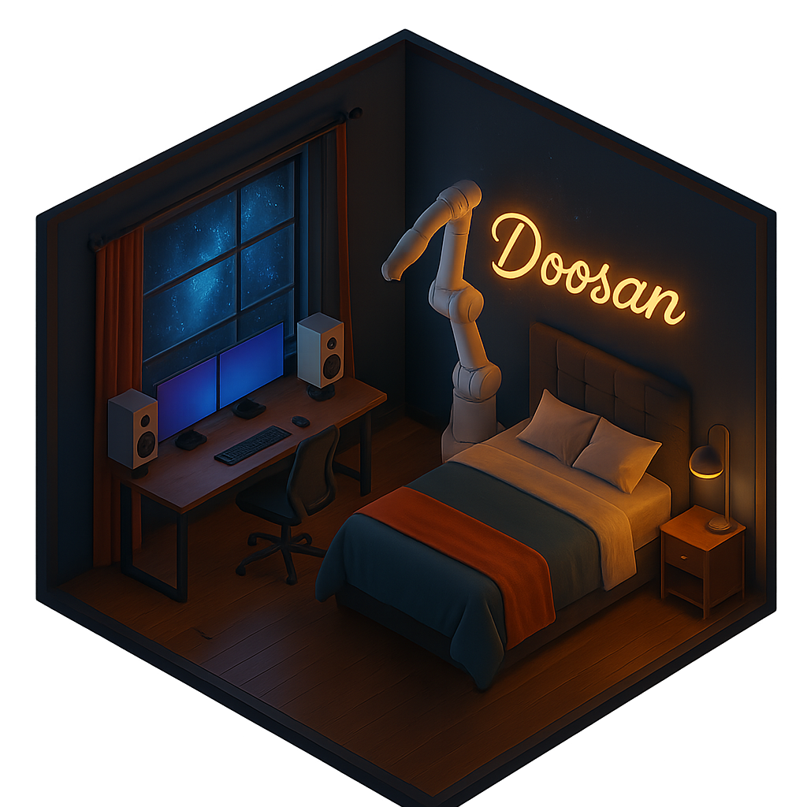
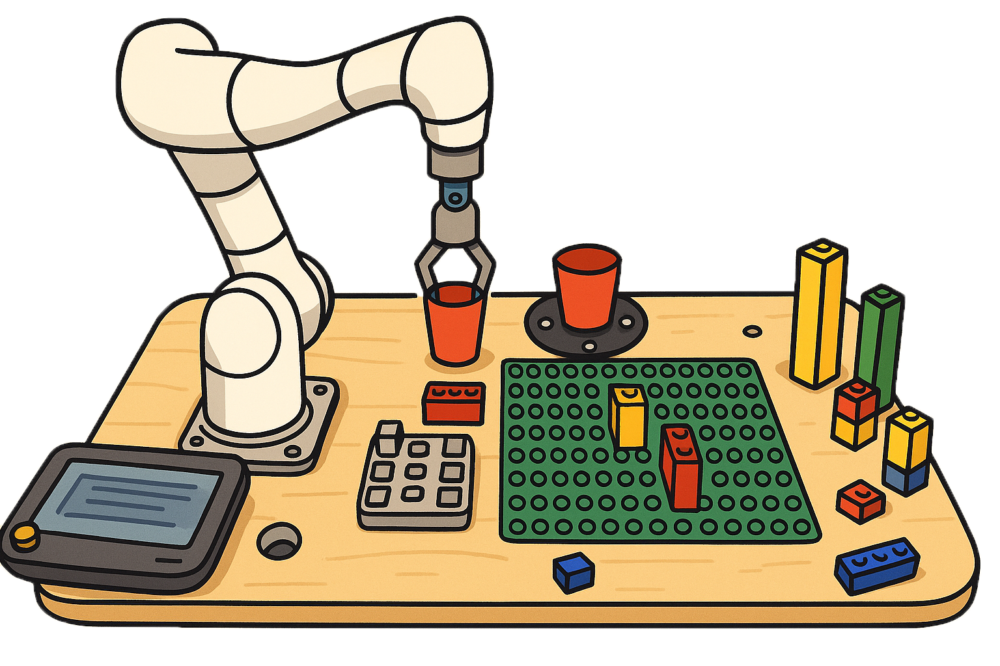
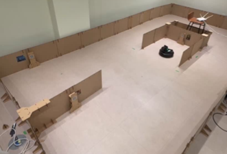

# 이한용
>-  Tel  : 010-9892-2765  
>- E-mail: lhybio07@naver.com  
>- 📂[노션 포트폴리오](https://incongruous-beechnut-147.notion.site/172db0a7dd18804ba13ce5275575179a)
---
# INTRO

>

---
# INDEX
>[나만의 Jarvis](## 나만의 Jarvis)
>

---
# 프로젝트 요약
***
## 나만의 Jarvis

> ##### 소개
>- 개발기간 : 2025.06.28 - 2025.07.05
>- 핵심 역할 : 프로그램 구조 설계 및 개발, LangChain 기반 응답 시스템 구현, 코드 통합/관리
>- 사용 기술 : : ROS 2, Python, LangChain, YOLO

> ##### 요약
>- lanchain과 yolo, 두산 협동로봇을 통한 출근전 비서 로봇
>- Github: https://github.com/SmiteLims/ROKEY3_collaborative_robot_work_assistant

---
## 러봇 하우스

> ##### 소개
>- 개발기간 : 2025.06.10 ~ 2025.06.21
>- 핵심 역할 : 로봇으로 설계도 모형 읽는 프로그램 개발, 코드 통합/관리
>- 사용 기술 : : ROS 2, Python

> ##### 요약
>- 두산 협동 로봇을 통해 로봇이 설계도를 이해하고 스스로 건물을 지을 수 없을까에서 시작된 프로젝트 (벽돌 쌓는 것을 레고 조립하는 것으로 대체)
>- Github: https://github.com/machyong/LoBotHouse

---
## 도둑잡는 가이드 봇

> ##### 소개
>- 개발기간 : 2025.05.27 ~ 2025.06.07
>- 핵심 역할 : 팀장, 멀티로봇 시스템 개발, 팀장, 혼잡도 모델 개발리
>- 사용 기술 : : ROS 2, Python, YOLO, SLAM

> ##### 요약
>- 박물관의 도슨트의 서비스 불균형과 야간 경비 사각지대를 보안하기 위해 시작한 프로젝트(터틀봇 4 사용)
>- Github: https://github.com/ROKEY-LearnedFromDoosan/GuardingRobot

---
## 강화학습을 통한 자율주차

> ##### 소개
>- 개발기간 : 2025.07.30 ~ 2025.07.04
>- 핵심 역할 : DQN을 통한 강화학습 코드 작성
>- 사용 기술 : : ROS 2, Python, DQN, tensorflow, OpenCV

> ##### 요약
>- 라이더를 사용하지 않는 자율주차 알고리즘을 강화학습으로 구현하여, 실제 차량 주차 시나리오에 가까운 환경에서 자율 주차 프로그램 개발
>- Github: https://github.com/machyong/auto_parking
